# BPM Architecture Overview

**Document Type**: Technical Architecture
**Module**: Business Process Management (BPM)
**Version**: 1.0
**Last Updated**: Current Date

## Table of Contents

1. [Architecture Overview](#architecture-overview)
2. [System Context](#system-context)
3. [Application Architecture](#application-architecture)
4. [Data Architecture](#data-architecture)
5. [Integration Architecture](#integration-architecture)
6. [Security Architecture](#security-architecture)
7. [Deployment Architecture](#deployment-architecture)
8. [Performance Architecture](#performance-architecture)

## Architecture Overview

### Architectural Principles

The Business Process Management (BPM) module follows enterprise architectural principles designed for scalability, flexibility, and performance:

- **Event-Driven Architecture**: Real-time workflow orchestration and execution
- **Microservices Design**: Loosely coupled, independently deployable components
- **API-First Approach**: RESTful and GraphQL endpoints for all functionality
- **BPMN 2.0 Compliance**: Standard business process modeling notation
- **Multi-Tenant Support**: Enterprise-wide deployment with isolation
- **Workflow Engine Abstraction**: Pluggable workflow execution engines

### Core Architectural Patterns

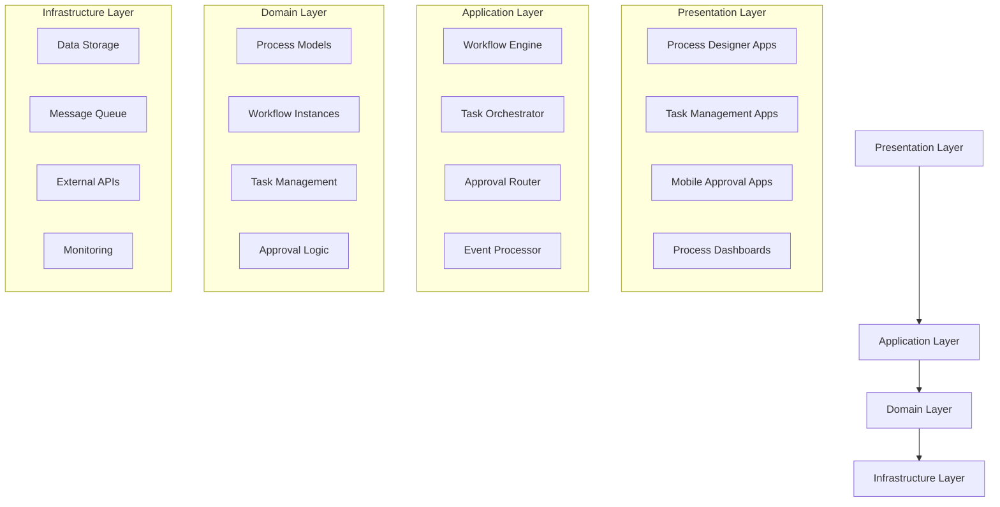

## System Context

### System Context Diagram

```mermaid
C4Context
    title System Context Diagram - BPM Module

    Person(users, "Business Users", "Employees using workflows")
    Person(managers, "Managers/Approvers", "Decision makers")
    Person(analysts, "Process Analysts", "Workflow designers")

    System(bpm, "BPM System", "Business Process Management")

    System_Ext(dms, "DMS System", "Domain Management")
    System_Ext(hrm, "HRM System", "Human Resources")
    System_Ext(email, "Email System", "Notifications")
    System_Ext(docmgmt, "Document Management", "Document storage")
    System_Ext(erp, "ERP System", "Enterprise data")

    Rel(users, bpm, "Execute workflows")
    Rel(managers, bpm, "Process approvals")
    Rel(analysts, bmp, "Design processes")

    Rel(bpm, dms, "Process definitions")
    Rel(bpm, hrm, "User data")
    Rel(bmp, email, "Send notifications")
    Rel(bpm, docmgmt, "Store documents")
    Rel(bpm, erp, "Business data")
```

### External Dependencies

- **DMS (Domain Management System)**: Process templates and organizational structure
- **HRM (Human Resource Management)**: User profiles and organizational hierarchy
- **Document Management**: Document storage, versioning, and retrieval
- **Email/Notification Services**: Multi-channel communication delivery
- **ERP Systems**: Business data and transaction processing
- **Authentication Services**: Single sign-on and user authentication

## Application Architecture

### Container Diagram

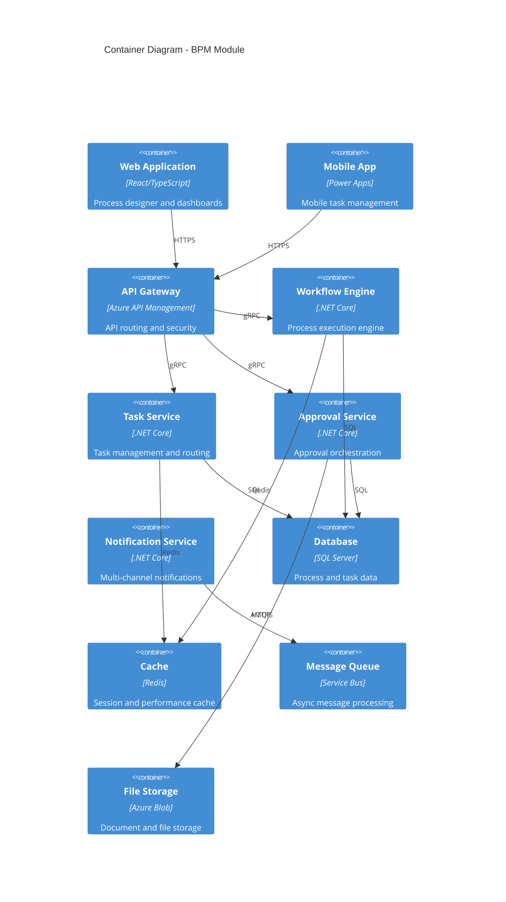

### Component Architecture

#### Workflow Engine Component

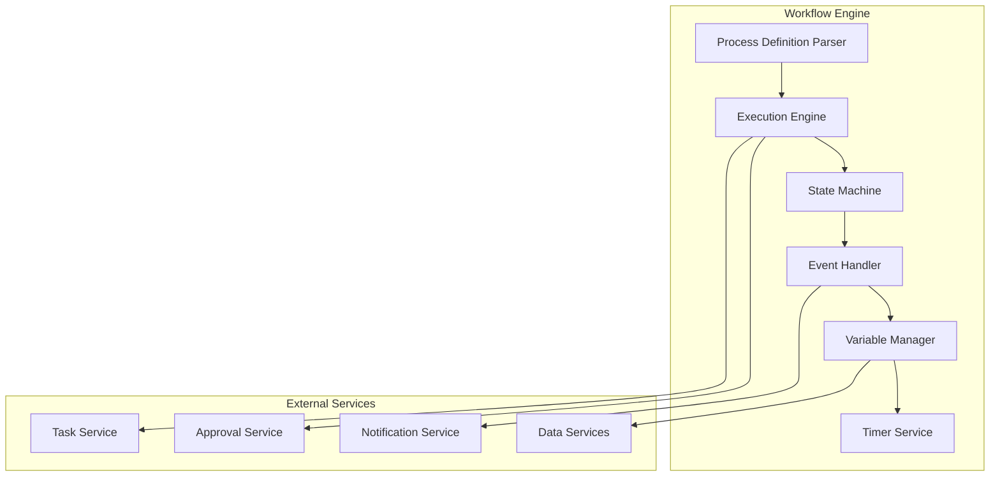

#### Task Management Component

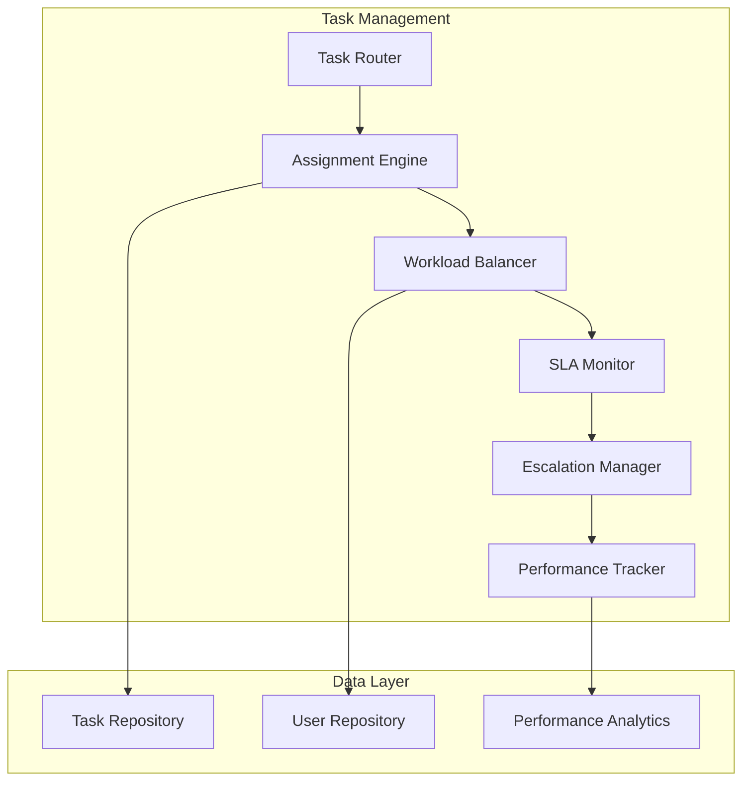

## Data Architecture

### Conceptual Data Model

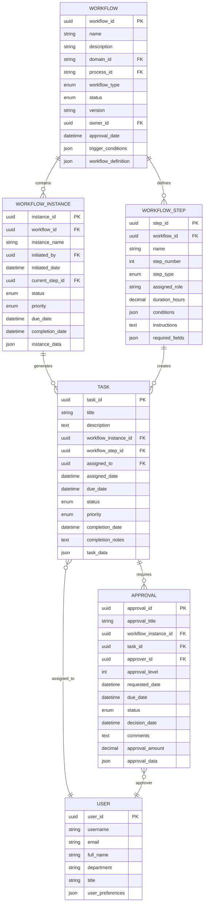

### Logical Data Model

#### Workflow Definition Schema

```json
{
  "workflow": {
    "id": "uuid",
    "name": "string",
    "version": "string",
    "description": "string",
    "triggers": [
      {
        "type": "manual|automatic|scheduled|event",
        "conditions": {}
      }
    ],
    "variables": [
      {
        "name": "string",
        "type": "string|number|boolean|date|object",
        "defaultValue": "any",
        "required": "boolean"
      }
    ],
    "steps": [
      {
        "id": "string",
        "name": "string",
        "type": "human_task|service_task|user_task|script_task|decision_gateway|parallel_gateway",
        "properties": {
          "assignee": "string",
          "candidateGroups": ["string"],
          "formKey": "string",
          "priority": "number",
          "dueDate": "string"
        },
        "conditions": {
          "expression": "string"
        },
        "outgoing": ["string"]
      }
    ],
    "gateways": [
      {
        "id": "string",
        "type": "exclusive|inclusive|parallel|event",
        "conditions": [
          {
            "expression": "string",
            "target": "string"
          }
        ]
      }
    ]
  }
}
```

### Physical Data Model

#### Database Tables

##### Workflow Management Tables

```sql
-- Workflow definitions
CREATE TABLE ep_workflow (
    ep_workflowid UNIQUEIDENTIFIER PRIMARY KEY DEFAULT NEWID(),
    ep_name NVARCHAR(255) NOT NULL,
    ep_description NTEXT,
    ep_domain_id UNIQUEIDENTIFIER REFERENCES ep_domain(ep_domainid),
    ep_process_id UNIQUEIDENTIFIER REFERENCES ep_process(ep_processid),
    ep_workflow_type NVARCHAR(50) CHECK (ep_workflow_type IN ('Approval', 'Review', 'Notification', 'Data Collection')),
    ep_status NVARCHAR(50) CHECK (ep_status IN ('Draft', 'Active', 'Inactive', 'Deprecated')),
    ep_version NVARCHAR(50),
    ep_owner_id UNIQUEIDENTIFIER REFERENCES systemuser(systemuserid),
    ep_approval_date DATETIME2,
    ep_trigger_conditions NTEXT,
    ep_workflow_definition NTEXT, -- JSON BPMN definition
    ep_created_date DATETIME2 DEFAULT GETUTCDATE(),
    ep_modified_date DATETIME2 DEFAULT GETUTCDATE()
);

-- Workflow steps
CREATE TABLE ep_workflow_step (
    ep_workflow_step_id UNIQUEIDENTIFIER PRIMARY KEY DEFAULT NEWID(),
    ep_workflow_id UNIQUEIDENTIFIER REFERENCES ep_workflow(ep_workflowid),
    ep_name NVARCHAR(255) NOT NULL,
    ep_step_number INT NOT NULL,
    ep_step_type NVARCHAR(50) CHECK (ep_step_type IN ('Human Task', 'System Task', 'Decision', 'Gateway')),
    ep_assigned_role NVARCHAR(255),
    ep_duration_hours DECIMAL(10,2),
    ep_conditions NTEXT,
    ep_instructions NTEXT,
    ep_required_fields NTEXT,
    ep_created_date DATETIME2 DEFAULT GETUTCDATE(),
    ep_modified_date DATETIME2 DEFAULT GETUTCDATE()
);

-- Workflow instances
CREATE TABLE ep_workflow_instance (
    ep_workflow_instance_id UNIQUEIDENTIFIER PRIMARY KEY DEFAULT NEWID(),
    ep_workflow_id UNIQUEIDENTIFIER REFERENCES ep_workflow(ep_workflowid),
    ep_instance_name NVARCHAR(255),
    ep_initiated_by UNIQUEIDENTIFIER REFERENCES systemuser(systemuserid),
    ep_initiated_date DATETIME2 DEFAULT GETUTCDATE(),
    ep_current_step_id UNIQUEIDENTIFIER REFERENCES ep_workflow_step(ep_workflow_step_id),
    ep_status NVARCHAR(50) CHECK (ep_status IN ('Running', 'Completed', 'Cancelled', 'Failed', 'Suspended')),
    ep_priority NVARCHAR(50) CHECK (ep_priority IN ('Low', 'Normal', 'High', 'Critical')),
    ep_due_date DATETIME2,
    ep_completion_date DATETIME2,
    ep_instance_data NTEXT, -- JSON data context
    ep_created_date DATETIME2 DEFAULT GETUTCDATE(),
    ep_modified_date DATETIME2 DEFAULT GETUTCDATE()
);

-- Tasks
CREATE TABLE ep_task (
    ep_task_id UNIQUEIDENTIFIER PRIMARY KEY DEFAULT NEWID(),
    ep_title NVARCHAR(255) NOT NULL,
    ep_description NTEXT,
    ep_workflow_instance_id UNIQUEIDENTIFIER REFERENCES ep_workflow_instance(ep_workflow_instance_id),
    ep_workflow_step_id UNIQUEIDENTIFIER REFERENCES ep_workflow_step(ep_workflow_step_id),
    ep_assigned_to UNIQUEIDENTIFIER REFERENCES systemuser(systemuserid),
    ep_assigned_date DATETIME2 DEFAULT GETUTCDATE(),
    ep_due_date DATETIME2,
    ep_status NVARCHAR(50) CHECK (ep_status IN ('Pending', 'In Progress', 'Completed', 'Cancelled', 'Overdue')),
    ep_priority NVARCHAR(50) CHECK (ep_priority IN ('Low', 'Normal', 'High', 'Critical')),
    ep_completion_date DATETIME2,
    ep_completion_notes NTEXT,
    ep_task_data NTEXT, -- JSON task context
    ep_created_date DATETIME2 DEFAULT GETUTCDATE(),
    ep_modified_date DATETIME2 DEFAULT GETUTCDATE()
);

-- Approvals
CREATE TABLE ep_approval (
    ep_approval_id UNIQUEIDENTIFIER PRIMARY KEY DEFAULT NEWID(),
    ep_approval_title NVARCHAR(255) NOT NULL,
    ep_workflow_instance_id UNIQUEIDENTIFIER REFERENCES ep_workflow_instance(ep_workflow_instance_id),
    ep_task_id UNIQUEIDENTIFIER REFERENCES ep_task(ep_task_id),
    ep_approver_id UNIQUEIDENTIFIER REFERENCES systemuser(systemuserid),
    ep_approval_level INT NOT NULL,
    ep_requested_date DATETIME2 DEFAULT GETUTCDATE(),
    ep_due_date DATETIME2,
    ep_status NVARCHAR(50) CHECK (ep_status IN ('Pending', 'Approved', 'Rejected', 'Delegated')),
    ep_decision_date DATETIME2,
    ep_comments NTEXT,
    ep_approval_amount MONEY,
    ep_approval_data NTEXT, -- JSON approval context
    ep_created_date DATETIME2 DEFAULT GETUTCDATE(),
    ep_modified_date DATETIME2 DEFAULT GETUTCDATE()
);
```

##### Performance and Monitoring Tables

```sql
-- Process performance metrics
CREATE TABLE ep_process_metrics (
    ep_metric_id UNIQUEIDENTIFIER PRIMARY KEY DEFAULT NEWID(),
    ep_workflow_id UNIQUEIDENTIFIER REFERENCES ep_workflow(ep_workflowid),
    ep_workflow_instance_id UNIQUEIDENTIFIER REFERENCES ep_workflow_instance(ep_workflow_instance_id),
    ep_metric_type NVARCHAR(100) NOT NULL,
    ep_metric_value DECIMAL(18,4),
    ep_measurement_date DATETIME2 DEFAULT GETUTCDATE(),
    ep_period_start DATETIME2,
    ep_period_end DATETIME2,
    ep_additional_data NTEXT -- JSON additional metrics
);

-- Task performance tracking
CREATE TABLE ep_task_performance (
    ep_performance_id UNIQUEIDENTIFIER PRIMARY KEY DEFAULT NEWID(),
    ep_task_id UNIQUEIDENTIFIER REFERENCES ep_task(ep_task_id),
    ep_user_id UNIQUEIDENTIFIER REFERENCES systemuser(systemuserid),
    ep_start_time DATETIME2,
    ep_end_time DATETIME2,
    ep_duration_minutes INT,
    ep_sla_met BIT,
    ep_quality_score DECIMAL(5,2),
    ep_rework_required BIT,
    ep_performance_data NTEXT -- JSON performance context
);
```

### Data Flow Architecture

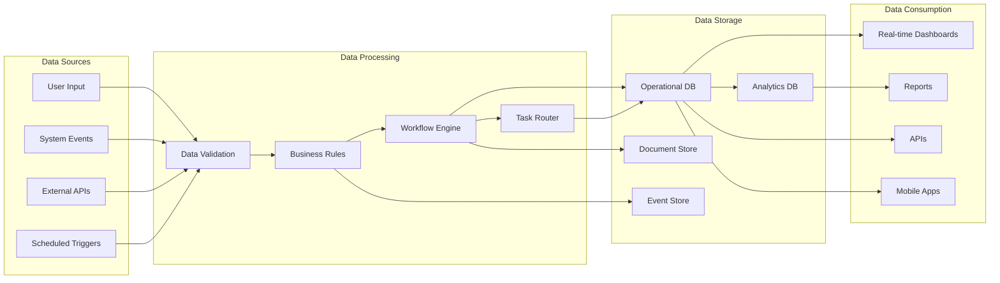

## Integration Architecture

### Integration Patterns

#### Event-Driven Integration

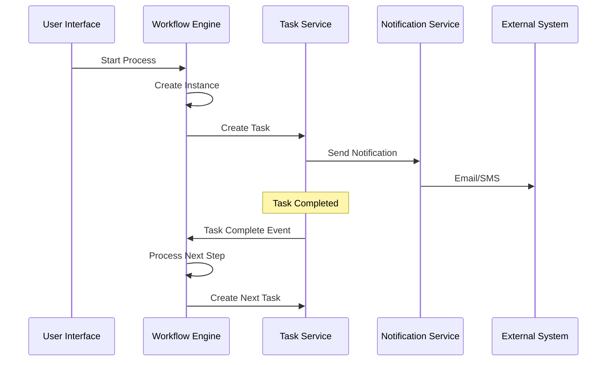

#### API Integration

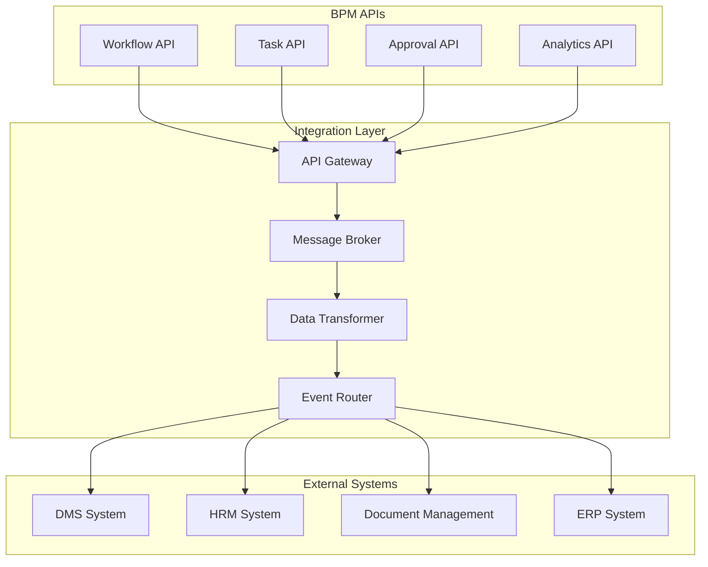

### Integration Specifications

#### DMS Integration

```json
{
  "integration_name": "DMS Process Synchronization",
  "type": "Real-time",
  "protocol": "REST API + Event-driven",
  "endpoints": {
    "get_processes": "GET /api/dms/processes",
    "get_domains": "GET /api/dms/domains",
    "process_changed": "Event: dms.process.changed"
  },
  "data_mapping": {
    "dms_process": "bpm_workflow_template",
    "dms_domain": "bmp_workflow_category"
  }
}
```

#### HRM Integration

```json
{
  "integration_name": "HRM User and Organization Sync",
  "type": "Batch + Real-time",
  "protocol": "REST API + Event-driven",
  "endpoints": {
    "get_users": "GET /api/hrm/users",
    "get_org_structure": "GET /api/hrm/organization",
    "user_changed": "Event: hrm.user.changed"
  },
  "data_mapping": {
    "hrm_employee": "bpm_user",
    "hrm_department": "bpm_team"
  }
}
```

## Security Architecture

### Security Layers

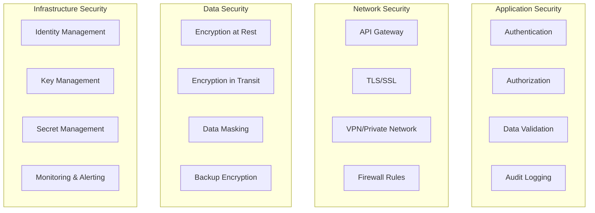

### Security Controls

#### Authentication & Authorization

```json
{
  "authentication": {
    "provider": "Azure Active Directory",
    "protocols": ["OAuth 2.0", "OpenID Connect"],
    "token_lifetime": "8 hours",
    "refresh_enabled": true
  },
  "authorization": {
    "model": "Role-Based Access Control (RBAC)",
    "roles": [
      "BPM Administrator",
      "Process Designer",
      "Process Owner",
      "Task User",
      "Approver"
    ],
    "permissions": [
      "workflow.create",
      "workflow.execute",
      "task.assign",
      "approval.decide"
    ]
  }
}
```

#### Data Protection

```json
{
  "data_classification": {
    "public": "Process templates, public documentation",
    "internal": "Process instances, task assignments",
    "confidential": "Approval decisions, performance data",
    "restricted": "Audit logs, security events"
  },
  "encryption": {
    "at_rest": "AES-256",
    "in_transit": "TLS 1.3",
    "key_management": "Azure Key Vault"
  },
  "audit": {
    "events": ["login", "process_start", "task_complete", "approval_decision"],
    "retention": "7 years",
    "immutable": true
  }
}
```

## Deployment Architecture

### Environment Strategy

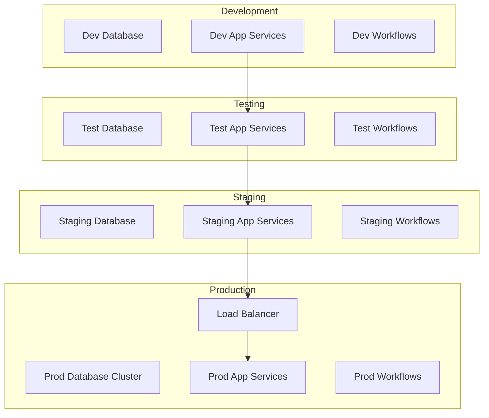

### Infrastructure Components

#### Azure Infrastructure

```yaml
infrastructure:
  compute:
    - Azure App Service (Web Apps)
    - Azure Container Instances
    - Azure Functions (Event Processing)

  data:
    - Azure SQL Database (Primary)
    - Azure Redis Cache (Session/Performance)
    - Azure Blob Storage (Documents)
    - Azure Service Bus (Messaging)

  security:
    - Azure Active Directory
    - Azure Key Vault
    - Azure Application Gateway

  monitoring:
    - Azure Monitor
    - Application Insights
    - Log Analytics

  devops:
    - Azure DevOps
    - Azure Container Registry
    - Azure Resource Manager
```

### Scalability Architecture

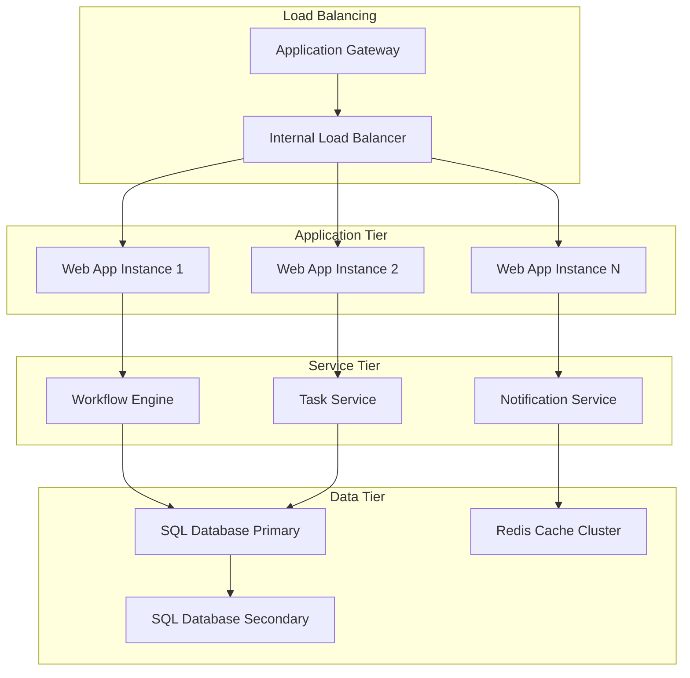

## Performance Architecture

### Performance Targets

| Metric               | Target      | Measurement             |
| -------------------- | ----------- | ----------------------- |
| API Response Time    | < 200ms     | 95th percentile         |
| Workflow Start Time  | < 1 second  | Average                 |
| Task Assignment Time | < 500ms     | 95th percentile         |
| Dashboard Load Time  | < 2 seconds | Average                 |
| Database Query Time  | < 100ms     | 95th percentile         |
| Concurrent Users     | 10,000+     | Peak load               |
| Throughput           | 1000 TPS    | Transactions per second |

### Performance Optimization

#### Caching Strategy

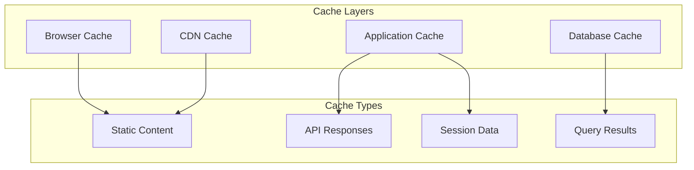

#### Database Optimization

```sql
-- Performance indexes
CREATE INDEX IX_workflow_instance_status
ON ep_workflow_instance (ep_status, ep_initiated_date);

CREATE INDEX IX_task_assigned_status
ON ep_task (ep_assigned_to, ep_status, ep_due_date);

CREATE INDEX IX_approval_approver_status
ON ep_approval (ep_approver_id, ep_status, ep_requested_date);

-- Partitioning strategy
CREATE PARTITION FUNCTION pf_date_range (DATETIME2)
AS RANGE RIGHT FOR VALUES ('2024-01-01', '2024-04-01', '2024-07-01', '2024-10-01');

CREATE PARTITION SCHEME ps_quarterly
AS PARTITION pf_date_range ALL TO ([PRIMARY]);

-- Archive old data
CREATE TABLE ep_workflow_instance_archive (
    -- Same structure as ep_workflow_instance
) ON ps_quarterly (ep_initiated_date);
```

### Monitoring and Alerting

#### Performance Monitoring

```json
{
  "performance_monitoring": {
    "metrics": [
      {
        "name": "workflow_execution_time",
        "threshold": "5 minutes",
        "alert_level": "warning"
      },
      {
        "name": "task_assignment_failures",
        "threshold": "5%",
        "alert_level": "critical"
      },
      {
        "name": "approval_delays",
        "threshold": "SLA + 20%",
        "alert_level": "warning"
      }
    ],
    "dashboards": [
      "Process Performance Overview",
      "Task Management Metrics",
      "System Health Dashboard"
    ]
  }
}
```

## Disaster Recovery

### Backup Strategy

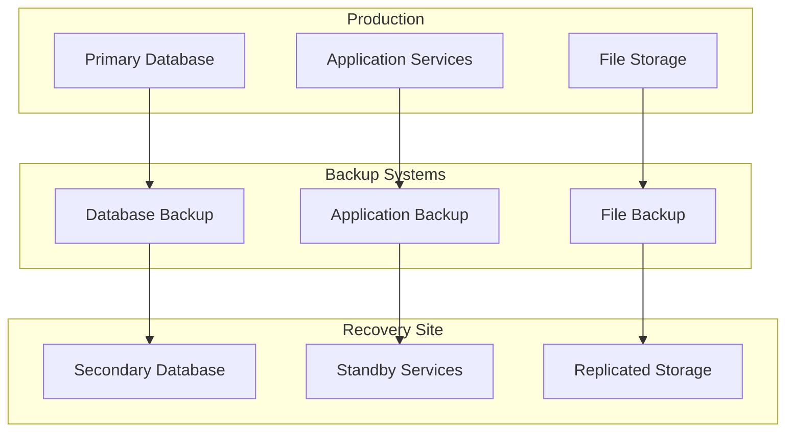

### Recovery Procedures

#### Recovery Time Objectives (RTO)

| Component    | RTO        | RPO        | Recovery Procedure    |
| ------------ | ---------- | ---------- | --------------------- |
| Database     | 4 hours    | 15 minutes | Automated failover    |
| Applications | 2 hours    | 5 minutes  | Blue-green deployment |
| File Storage | 1 hour     | 1 hour     | Geo-replication       |
| Workflows    | 30 minutes | Real-time  | Event replay          |

---

## Document Control

- **Version**: 1.0
- **Approved By**: Architecture Review Board
- **Review Date**: Quarterly
- **Next Review**: Next Quarter

## Related Documents

- [BPM Implementation Guide](../implementation/bpm-implementation.md)
- [BPM Technical Specifications](../technical/bmp-specs.md)
- [BPM Security Guide](../security/bpm-security.md)
